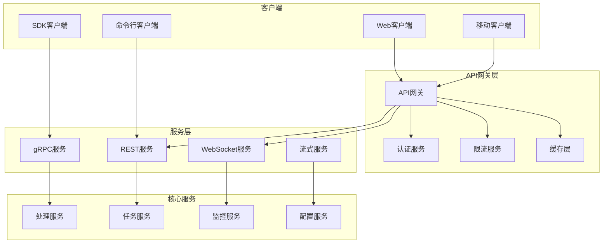

# NewBee 统一数据处理平台 - API文档

## 📋 目录

- [1. API概览](#1-api概览)
- [2. 认证与授权](#2-认证与授权)
- [3. gRPC API](#3-grpc-api)
- [4. REST API](#4-rest-api)
- [5. WebSocket API](#5-websocket-api)
- [6. SDK使用指南](#6-sdk使用指南)
- [7. 错误处理](#7-错误处理)
- [8. 限流与监控](#8-限流与监控)

## 1. API概览

### 1.1 API架构图



### 1.2 支持的API类型

| API类型 | 协议 | 端口 | 用途 | 性能特点 |
|---------|------|------|------|----------|
| gRPC | HTTP/2 | 9000 | 服务间通信 | 高性能、类型安全 |
| REST | HTTP/1.1 | 8080 | Web集成 | 通用性强、易于调试 |
| WebSocket | WebSocket | 8081 | 实时通信 | 双向通信、低延迟 |
| GraphQL | HTTP | 8082 | 灵活查询 | 按需获取、减少请求 |
| 流式API | gRPC Stream | 9001 | 大数据传输 | 流式处理、内存效率高 |

### 1.3 API版本管理

```
v1/     - 稳定版本，长期支持
v2/     - 当前开发版本
beta/   - 测试版本
alpha/  - 实验性功能
```

## 2. 认证与授权

### 2.1 认证方式

#### 2.1.1 JWT认证 (推荐)

```bash
# 获取访问令牌
curl -X POST http://localhost:8080/auth/login \
  -H "Content-Type: application/json" \
  -d '{
    "username": "user@example.com",
    "password": "password",
    "tenant_id": "tenant123"
  }'

# 响应
{
  "access_token": "eyJhbGciOiJIUzI1NiIsInR5cCI6IkpXVCJ9...",
  "refresh_token": "eyJhbGciOiJIUzI1NiIsInR5cCI6IkpXVCJ9...",
  "expires_in": 3600,
  "token_type": "Bearer"
}
```

#### 2.1.2 API密钥认证

```bash
# 使用API密钥
curl -X GET http://localhost:8080/api/v1/tasks \
  -H "X-API-Key: your-api-key" \
  -H "X-Tenant-ID: tenant123"
```

#### 2.1.3 请求头格式

```http
Authorization: Bearer <access_token>
X-Tenant-ID: <tenant_id>
X-User-ID: <user_id>
X-Request-ID: <unique_request_id>
Content-Type: application/json
Accept: application/json
```

### 2.2 权限控制

#### 2.2.1 权限级别

```go
// 权限级别定义
const (
    PermissionRead   = "read"     // 读取权限
    PermissionWrite  = "write"    // 写入权限
    PermissionDelete = "delete"   // 删除权限
    PermissionAdmin  = "admin"    // 管理权限
)

// 数据权限范围
const (
    DataScopeAll         = "all"          // 全部数据
    DataScopeCustomDept  = "custom_dept"  // 自定义部门
    DataScopeOwnDept     = "own_dept"     // 本部门
    DataScopeSelf        = "self"         // 仅本人
)
```

#### 2.2.2 权限检查示例

```bash
# 检查用户权限
curl -X GET http://localhost:8080/api/v1/permissions/check \
  -H "Authorization: Bearer <token>" \
  -H "Content-Type: application/json" \
  -d '{
    "resource": "processing_task",
    "action": "create",
    "context": {
      "department_id": "dept123"
    }
  }'
```

## 3. gRPC API

### 3.1 服务定义

```protobuf
// unified_io.proto
syntax = "proto3";

package unified_io.v1;

option go_package = "github.com/newbee/unified-io/api/proto/v1";

// 统一数据处理服务
service UnifiedIOService {
  // 数据处理接口
  rpc ProcessData(ProcessDataRequest) returns (ProcessDataResponse);
  rpc ProcessDataStream(stream ProcessDataRequest) returns (stream ProcessDataResponse);
  rpc ProcessDataBatch(ProcessDataBatchRequest) returns (ProcessDataBatchResponse);
  
  // 任务管理接口
  rpc CreateTask(CreateTaskRequest) returns (CreateTaskResponse);
  rpc GetTask(GetTaskRequest) returns (GetTaskResponse);
  rpc ListTasks(ListTasksRequest) returns (ListTasksResponse);
  rpc CancelTask(CancelTaskRequest) returns (CancelTaskResponse);
  
  // 监控接口
  rpc GetSystemStatus(GetSystemStatusRequest) returns (GetSystemStatusResponse);
  rpc GetMetrics(GetMetricsRequest) returns (GetMetricsResponse);
  rpc SubscribeEvents(SubscribeEventsRequest) returns (stream EventResponse);
  
  // 配置管理接口
  rpc GetConfig(GetConfigRequest) returns (GetConfigResponse);
  rpc UpdateConfig(UpdateConfigRequest) returns (UpdateConfigResponse);
}

// 任务管理服务
service TaskService {
  rpc SubmitTask(SubmitTaskRequest) returns (SubmitTaskResponse);
  rpc GetTaskStatus(GetTaskStatusRequest) returns (GetTaskStatusResponse);
  rpc ListTaskHistory(ListTaskHistoryRequest) returns (ListTaskHistoryResponse);
  rpc GetTaskLogs(GetTaskLogsRequest) returns (stream TaskLogResponse);
}

// 监控服务
service MonitoringService {
  rpc GetPerformanceMetrics(GetPerformanceMetricsRequest) returns (GetPerformanceMetricsResponse);
  rpc GetHealthStatus(GetHealthStatusRequest) returns (GetHealthStatusResponse);
  rpc GetAlerts(GetAlertsRequest) returns (GetAlertsResponse);
  rpc SubscribeAlerts(SubscribeAlertsRequest) returns (stream AlertResponse);
}
```

### 3.2 数据结构定义

```protobuf
// 处理数据请求
message ProcessDataRequest {
  string request_id = 1;
  uint64 tenant_id = 2;
  uint64 user_id = 3;
  string data_type = 4;
  bytes payload = 5;
  map<string, string> headers = 6;
  map<string, google.protobuf.Any> metadata = 7;
  ProcessingOptions options = 8;
}

// 处理选项
message ProcessingOptions {
  Priority priority = 1;
  google.protobuf.Duration timeout = 2;
  RetryConfig retry = 3;
  bool async = 4;
  string callback_url = 5;
}

// 优先级枚举
enum Priority {
  PRIORITY_LOW = 0;
  PRIORITY_NORMAL = 1;
  PRIORITY_HIGH = 2;
  PRIORITY_URGENT = 3;
}

// 重试配置
message RetryConfig {
  int32 max_attempts = 1;
  google.protobuf.Duration initial_interval = 2;
  google.protobuf.Duration max_interval = 3;
  double multiplier = 4;
}

// 处理响应
message ProcessDataResponse {
  string request_id = 1;
  bool success = 2;
  bytes result_data = 3;
  string error_message = 4;
  string error_code = 5;
  google.protobuf.Duration processing_time = 6;
  map<string, google.protobuf.Any> metadata = 7;
}

// 任务状态
message TaskStatus {
  string task_id = 1;
  TaskState state = 2;
  double progress = 3;
  google.protobuf.Timestamp created_at = 4;
  google.protobuf.Timestamp started_at = 5;
  google.protobuf.Timestamp completed_at = 6;
  string worker_id = 7;
  string error_message = 8;
}

// 任务状态枚举
enum TaskState {
  TASK_STATE_PENDING = 0;
  TASK_STATE_RUNNING = 1;
  TASK_STATE_COMPLETED = 2;
  TASK_STATE_FAILED = 3;
  TASK_STATE_CANCELLED = 4;
}
```

### 3.3 客户端使用示例

#### 3.3.1 Go客户端

```go
package main

import (
    "context"
    "log"
    "time"
    
    "google.golang.org/grpc"
    "google.golang.org/grpc/credentials/insecure"
    pb "github.com/newbee/unified-io/api/proto/v1"
)

func main() {
    // 建立连接
    conn, err := grpc.Dial("localhost:9000", grpc.WithTransportCredentials(insecure.NewCredentials()))
    if err != nil {
        log.Fatalf("连接失败: %v", err)
    }
    defer conn.Close()
    
    // 创建客户端
    client := pb.NewUnifiedIOServiceClient(conn)
    
    // 设置上下文和超时
    ctx, cancel := context.WithTimeout(context.Background(), 30*time.Second)
    defer cancel()
    
    // 添加认证信息
    ctx = metadata.AppendToOutgoingContext(ctx,
        "authorization", "Bearer "+token,
        "x-tenant-id", "tenant123",
        "x-user-id", "user456",
    )
    
    // 调用数据处理接口
    req := &pb.ProcessDataRequest{
        RequestId: "req_123",
        TenantId:  123,
        UserId:    456,
        DataType:  "json",
        Payload:   []byte(`{"key": "value"}`),
        Options: &pb.ProcessingOptions{
            Priority: pb.Priority_PRIORITY_HIGH,
            Timeout:  durationpb.New(60 * time.Second),
            Async:    false,
        },
    }
    
    resp, err := client.ProcessData(ctx, req)
    if err != nil {
        log.Fatalf("处理失败: %v", err)
    }
    
    log.Printf("处理结果: %+v", resp)
}
```

#### 3.3.2 流式处理示例

```go
func streamProcessing(client pb.UnifiedIOServiceClient) {
    ctx := context.Background()
    
    // 创建双向流
    stream, err := client.ProcessDataStream(ctx)
    if err != nil {
        log.Fatalf("创建流失败: %v", err)
    }
    
    // 发送数据的goroutine
    go func() {
        for i := 0; i < 10; i++ {
            req := &pb.ProcessDataRequest{
                RequestId: fmt.Sprintf("stream_req_%d", i),
                TenantId:  123,
                UserId:    456,
                DataType:  "json",
                Payload:   []byte(fmt.Sprintf(`{"index": %d}`, i)),
            }
            
            if err := stream.Send(req); err != nil {
                log.Printf("发送失败: %v", err)
                return
            }
            
            time.Sleep(100 * time.Millisecond)
        }
        stream.CloseSend()
    }()
    
    // 接收结果
    for {
        resp, err := stream.Recv()
        if err == io.EOF {
            break
        }
        if err != nil {
            log.Fatalf("接收失败: %v", err)
        }
        
        log.Printf("收到响应: %+v", resp)
    }
}
```

## 4. REST API

### 4.1 API端点概览

#### 4.1.1 数据处理API

```http
POST   /api/v1/process              # 同步数据处理
POST   /api/v1/process/async        # 异步数据处理  
POST   /api/v1/process/batch        # 批量数据处理
GET    /api/v1/process/{id}         # 获取处理结果
DELETE /api/v1/process/{id}         # 取消处理任务
```

#### 4.1.2 任务管理API

```http
POST   /api/v1/tasks                # 创建任务
GET    /api/v1/tasks                # 获取任务列表
GET    /api/v1/tasks/{id}           # 获取任务详情
PUT    /api/v1/tasks/{id}           # 更新任务
DELETE /api/v1/tasks/{id}           # 删除任务
POST   /api/v1/tasks/{id}/cancel    # 取消任务
GET    /api/v1/tasks/{id}/logs      # 获取任务日志
GET    /api/v1/tasks/{id}/status    # 获取任务状态
```

#### 4.1.3 监控API

```http
GET    /api/v1/status               # 系统状态
GET    /api/v1/health               # 健康检查
GET    /api/v1/metrics              # 系统指标
GET    /api/v1/performance          # 性能报告
GET    /api/v1/alerts               # 告警信息
```

#### 4.1.4 配置管理API

```http
GET    /api/v1/config               # 获取配置
PUT    /api/v1/config               # 更新配置
POST   /api/v1/config/reload        # 重载配置
GET    /api/v1/config/schema        # 获取配置模式
```

### 4.2 详细API规范

#### 4.2.1 数据处理API

**同步数据处理**

```http
POST /api/v1/process
Content-Type: application/json
Authorization: Bearer <token>
X-Tenant-ID: <tenant_id>

{
  "data_type": "json",
  "payload": {
    "key": "value",
    "nested": {
      "data": "example"
    }
  },
  "options": {
    "priority": "high",
    "timeout": "60s",
    "retry": {
      "max_attempts": 3,
      "initial_interval": "1s",
      "max_interval": "10s",
      "multiplier": 2.0
    }
  },
  "metadata": {
    "source": "api",
    "version": "1.0"
  }
}
```

**响应格式**

```json
{
  "request_id": "req_123456789",
  "success": true,
  "result": {
    "processed_data": {
      "output": "processed_value"
    },
    "statistics": {
      "processing_time": "150ms",
      "memory_used": "1.2MB",
      "cpu_time": "50ms"
    }
  },
  "metadata": {
    "worker_id": "worker_001",
    "version": "1.0.0"
  },
  "timestamp": "2024-01-01T12:00:00Z"
}
```

**异步数据处理**

```http
POST /api/v1/process/async
Content-Type: application/json
Authorization: Bearer <token>

{
  "data_type": "json",
  "payload": {...},
  "callback_url": "https://your-domain.com/webhook/callback",
  "options": {
    "priority": "normal",
    "timeout": "300s"
  }
}
```

**异步响应**

```json
{
  "task_id": "task_123456789",
  "status": "pending",
  "estimated_completion": "2024-01-01T12:05:00Z",
  "callback_url": "https://your-domain.com/webhook/callback",
  "status_url": "/api/v1/tasks/task_123456789/status"
}
```

#### 4.2.2 任务管理API

**创建任务**

```http
POST /api/v1/tasks
Content-Type: application/json
Authorization: Bearer <token>

{
  "name": "数据处理任务",
  "description": "处理用户上传的文件",
  "type": "data_processing",
  "priority": "high",
  "data": {
    "input_file": "file_123.json",
    "output_format": "csv"
  },
  "schedule": {
    "type": "once",
    "run_at": "2024-01-01T15:00:00Z"
  },
  "dependencies": ["task_456", "task_789"],
  "resources": {
    "cpu": "500m",
    "memory": "1Gi",
    "timeout": "1h"
  }
}
```

**获取任务列表**

```http
GET /api/v1/tasks?page=1&size=20&status=running&priority=high&sort=created_at:desc
Authorization: Bearer <token>
```

**响应格式**

```json
{
  "data": [
    {
      "id": "task_123456789",
      "name": "数据处理任务",
      "type": "data_processing",
      "status": "running",
      "priority": "high",
      "progress": 75.5,
      "created_at": "2024-01-01T12:00:00Z",
      "started_at": "2024-01-01T12:01:00Z",
      "estimated_completion": "2024-01-01T12:10:00Z",
      "worker_id": "worker_001",
      "resource_usage": {
        "cpu": "450m",
        "memory": "800Mi"
      }
    }
  ],
  "pagination": {
    "page": 1,
    "size": 20,
    "total": 150,
    "total_pages": 8
  },
  "filters": {
    "status": "running",
    "priority": "high"
  }
}
```

#### 4.2.3 监控API

**获取系统状态**

```http
GET /api/v1/status
Authorization: Bearer <token>
```

**响应格式**

```json
{
  "system": {
    "status": "healthy",
    "version": "1.0.0",
    "uptime": "72h30m15s",
    "build_time": "2024-01-01T00:00:00Z"
  },
  "services": {
    "processing_engine": "healthy",
    "task_scheduler": "healthy",
    "database": "healthy",
    "redis": "healthy",
    "consul": "healthy"
  },
  "resources": {
    "cpu_usage": 65.5,
    "memory_usage": 78.2,
    "disk_usage": 45.3,
    "goroutines": 1250,
    "connections": 156
  },
  "performance": {
    "requests_per_second": 1200,
    "average_latency": "25ms",
    "p95_latency": "50ms",
    "error_rate": 0.12
  }
}
```

**获取性能指标**

```http
GET /api/v1/metrics?from=2024-01-01T00:00:00Z&to=2024-01-01T23:59:59Z&step=5m
Authorization: Bearer <token>
```

### 4.3 错误响应格式

```json
{
  "error": {
    "code": "INVALID_REQUEST",
    "message": "请求参数无效",
    "details": "字段 'data_type' 是必需的",
    "request_id": "req_123456789",
    "timestamp": "2024-01-01T12:00:00Z",
    "path": "/api/v1/process"
  },
  "validation_errors": [
    {
      "field": "data_type",
      "message": "不能为空",
      "code": "REQUIRED"
    },
    {
      "field": "payload",
      "message": "必须是有效的JSON格式",
      "code": "INVALID_FORMAT"
    }
  ]
}
```

### 4.4 分页和过滤

#### 4.4.1 分页参数

```http
GET /api/v1/tasks?page=2&size=50&sort=created_at:desc,priority:asc
```

#### 4.4.2 过滤参数

```http
GET /api/v1/tasks?status=running,completed&priority=high&created_after=2024-01-01T00:00:00Z
```

#### 4.4.3 搜索参数

```http
GET /api/v1/tasks?search=数据处理&fields=name,description&fuzzy=true
```

## 5. WebSocket API

### 5.1 连接建立

```javascript
// JavaScript客户端示例
const ws = new WebSocket('ws://localhost:8081/ws/v1/events');

// 连接建立后发送认证信息
ws.onopen = function(event) {
    ws.send(JSON.stringify({
        type: 'auth',
        data: {
            token: 'your_jwt_token',
            tenant_id: 'tenant123',
            user_id: 'user456'
        }
    }));
};

// 订阅事件
ws.send(JSON.stringify({
    type: 'subscribe',
    data: {
        events: ['task.status_changed', 'system.alert', 'performance.threshold_exceeded'],
        filters: {
            tenant_id: 'tenant123',
            priority: ['high', 'urgent']
        }
    }
}));
```

### 5.2 事件类型

#### 5.2.1 任务事件

```json
{
  "type": "task.status_changed",
  "timestamp": "2024-01-01T12:00:00Z",
  "data": {
    "task_id": "task_123456789",
    "old_status": "running",
    "new_status": "completed",
    "progress": 100,
    "result": {
      "success": true,
      "output_size": "1.2MB"
    }
  }
}
```

#### 5.2.2 系统告警事件

```json
{
  "type": "system.alert",
  "timestamp": "2024-01-01T12:00:00Z",
  "data": {
    "alert_id": "alert_987654321",
    "severity": "warning",
    "title": "高CPU使用率",
    "description": "CPU使用率超过80%，持续时间5分钟",
    "metrics": {
      "cpu_usage": 85.5,
      "threshold": 80.0
    },
    "actions": ["scale_up", "notify_admin"]
  }
}
```

#### 5.2.3 性能事件

```json
{
  "type": "performance.threshold_exceeded",
  "timestamp": "2024-01-01T12:00:00Z",
  "data": {
    "metric": "response_latency",
    "current_value": 150,
    "threshold": 100,
    "unit": "ms",
    "duration": "2m30s",
    "affected_services": ["processing_engine", "task_scheduler"]
  }
}
```

### 5.3 客户端命令

#### 5.3.1 订阅事件

```json
{
  "type": "subscribe",
  "data": {
    "events": ["task.*", "system.alert"],
    "filters": {
      "tenant_id": "tenant123",
      "severity": ["warning", "error"]
    }
  }
}
```

#### 5.3.2 取消订阅

```json
{
  "type": "unsubscribe",
  "data": {
    "events": ["task.status_changed"]
  }
}
```

#### 5.3.3 发送命令

```json
{
  "type": "command",
  "data": {
    "action": "cancel_task",
    "parameters": {
      "task_id": "task_123456789",
      "reason": "user_requested"
    }
  }
}
```

## 6. SDK使用指南

### 6.1 Go SDK

#### 6.1.1 安装

```bash
go get github.com/newbee/unified-io-sdk-go
```

#### 6.1.2 基本使用

```go
package main

import (
    "context"
    "log"
    
    "github.com/newbee/unified-io-sdk-go"
)

func main() {
    // 创建客户端
    client := unifiedio.NewClient(&unifiedio.Config{
        Endpoint:  "localhost:9000",
        Token:     "your_jwt_token",
        TenantID:  "tenant123",
        UserID:    "user456",
        Timeout:   30 * time.Second,
    })
    
    // 数据处理
    result, err := client.ProcessData(context.Background(), &unifiedio.ProcessRequest{
        DataType: "json",
        Payload:  map[string]interface{}{"key": "value"},
        Options: &unifiedio.ProcessOptions{
            Priority: unifiedio.PriorityHigh,
            Async:    false,
        },
    })
    if err != nil {
        log.Fatalf("处理失败: %v", err)
    }
    
    log.Printf("结果: %+v", result)
}
```

#### 6.1.3 异步处理

```go
// 异步处理
taskID, err := client.ProcessDataAsync(ctx, request)
if err != nil {
    log.Fatalf("提交失败: %v", err)
}

// 轮询状态
for {
    status, err := client.GetTaskStatus(ctx, taskID)
    if err != nil {
        log.Printf("获取状态失败: %v", err)
        break
    }
    
    if status.State == unifiedio.TaskCompleted {
        log.Printf("任务完成: %+v", status.Result)
        break
    } else if status.State == unifiedio.TaskFailed {
        log.Printf("任务失败: %v", status.Error)
        break
    }
    
    time.Sleep(1 * time.Second)
}
```

### 6.2 Python SDK

#### 6.2.1 安装

```bash
pip install unified-io-sdk
```

#### 6.2.2 基本使用

```python
from unified_io_sdk import UnifiedIOClient, ProcessRequest, ProcessOptions

# 创建客户端
client = UnifiedIOClient(
    endpoint="localhost:9000",
    token="your_jwt_token",
    tenant_id="tenant123",
    user_id="user456"
)

# 数据处理
request = ProcessRequest(
    data_type="json",
    payload={"key": "value"},
    options=ProcessOptions(
        priority="high",
        async_mode=False
    )
)

result = client.process_data(request)
print(f"结果: {result}")
```

#### 6.2.3 流式处理

```python
import asyncio

async def stream_processing():
    async with client.process_data_stream() as stream:
        # 发送数据
        for i in range(10):
            request = ProcessRequest(
                data_type="json",
                payload={"index": i}
            )
            await stream.send(request)
        
        # 接收结果
        async for response in stream:
            print(f"收到响应: {response}")

asyncio.run(stream_processing())
```

### 6.3 JavaScript SDK

#### 6.3.1 安装

```bash
npm install @newbee/unified-io-sdk
```

#### 6.3.2 基本使用

```javascript
import { UnifiedIOClient } from '@newbee/unified-io-sdk';

// 创建客户端
const client = new UnifiedIOClient({
    endpoint: 'http://localhost:8080',
    token: 'your_jwt_token',
    tenantId: 'tenant123',
    userId: 'user456'
});

// 数据处理
async function processData() {
    try {
        const result = await client.processData({
            dataType: 'json',
            payload: { key: 'value' },
            options: {
                priority: 'high',
                async: false
            }
        });
        
        console.log('结果:', result);
    } catch (error) {
        console.error('处理失败:', error);
    }
}
```

#### 6.3.3 WebSocket集成

```javascript
// 监听事件
client.onTaskStatusChanged((event) => {
    console.log('任务状态变化:', event);
});

client.onSystemAlert((alert) => {
    console.log('系统告警:', alert);
});

// 连接WebSocket
await client.connect();
```

## 7. 错误处理

### 7.1 错误代码

| 错误代码 | HTTP状态码 | 描述 | 解决方案 |
|----------|------------|------|----------|
| `INVALID_REQUEST` | 400 | 请求参数无效 | 检查请求格式和参数 |
| `UNAUTHORIZED` | 401 | 认证失败 | 检查访问令牌 |
| `FORBIDDEN` | 403 | 权限不足 | 检查用户权限 |
| `NOT_FOUND` | 404 | 资源不存在 | 检查资源ID |
| `RATE_LIMITED` | 429 | 请求频率超限 | 降低请求频率 |
| `INTERNAL_ERROR` | 500 | 服务器内部错误 | 联系技术支持 |
| `SERVICE_UNAVAILABLE` | 503 | 服务不可用 | 稍后重试 |

### 7.2 重试策略

#### 7.2.1 指数退避重试

```go
func retryWithBackoff(operation func() error, maxAttempts int) error {
    var err error
    for attempt := 0; attempt < maxAttempts; attempt++ {
        err = operation()
        if err == nil {
            return nil
        }
        
        // 检查是否为可重试错误
        if !isRetryableError(err) {
            return err
        }
        
        // 指数退避
        backoff := time.Duration(math.Pow(2, float64(attempt))) * time.Second
        time.Sleep(backoff)
    }
    return err
}
```

#### 7.2.2 熔断器模式

```go
type CircuitBreaker struct {
    state        State
    failures     int
    threshold    int
    timeout      time.Duration
    lastFailTime time.Time
}

func (cb *CircuitBreaker) Call(operation func() error) error {
    if cb.state == Open {
        if time.Since(cb.lastFailTime) > cb.timeout {
            cb.state = HalfOpen
        } else {
            return ErrCircuitOpen
        }
    }
    
    err := operation()
    if err != nil {
        cb.onFailure()
        return err
    }
    
    cb.onSuccess()
    return nil
}
```

## 8. 限流与监控

### 8.1 限流策略

#### 8.1.1 基于用户的限流

```http
# 请求头
X-RateLimit-Limit: 1000      # 每小时限制
X-RateLimit-Remaining: 856   # 剩余次数
X-RateLimit-Reset: 1640995200 # 重置时间戳
```

#### 8.1.2 基于租户的限流

```http
# 响应头
X-Tenant-RateLimit-Limit: 10000
X-Tenant-RateLimit-Remaining: 7234
X-Tenant-RateLimit-Reset: 1640995200
```

### 8.2 监控指标

#### 8.2.1 API指标

```prometheus
# 请求总数
unified_io_api_requests_total{method="POST",endpoint="/api/v1/process",status="200"}

# 请求延迟
unified_io_api_request_duration_seconds{method="POST",endpoint="/api/v1/process"}

# 错误率
rate(unified_io_api_requests_total{status=~"5.."}[5m]) / 
rate(unified_io_api_requests_total[5m])
```

#### 8.2.2 业务指标

```prometheus
# 任务处理指标
unified_io_tasks_total{status="completed",priority="high"}
unified_io_task_duration_seconds{type="data_processing"}
unified_io_queue_size{queue="high_priority"}

# 资源使用指标
unified_io_cpu_usage_percent
unified_io_memory_usage_bytes
unified_io_goroutines_count
```

### 8.3 告警规则

```yaml
groups:
  - name: unified-io-api
    rules:
      - alert: HighAPIErrorRate
        expr: rate(unified_io_api_requests_total{status=~"5.."}[5m]) / rate(unified_io_api_requests_total[5m]) > 0.05
        for: 2m
        annotations:
          summary: "API错误率过高"
          description: "过去5分钟API错误率超过5%"
      
      - alert: HighAPILatency
        expr: histogram_quantile(0.95, unified_io_api_request_duration_seconds_bucket) > 1
        for: 5m
        annotations:
          summary: "API延迟过高"
          description: "API P95延迟超过1秒"
```

---

**API文档持续更新中，如有问题请联系技术支持团队** 📞