# NewBee 统一数据处理平台 - 架构文档

## 📋 目录

- [1. 系统架构概览](#1-系统架构概览)
- [2. 核心组件架构](#2-核心组件架构)
- [3. 数据流架构](#3-数据流架构)
- [4. 部署架构](#4-部署架构)
- [5. 安全架构](#5-安全架构)
- [6. 监控架构](#6-监控架构)
- [7. 性能架构](#7-性能架构)
- [8. 扩展性设计](#8-扩展性设计)

## 1. 系统架构概览

### 1.1 整体架构图

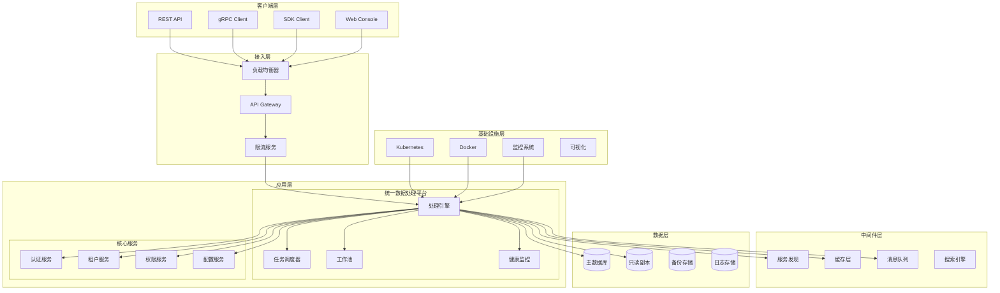

### 1.2 架构原则

#### 1.2.1 设计原则
- **高内聚，低耦合** - 模块化设计，明确的接口边界
- **单一职责** - 每个组件专注于特定功能
- **开放封闭** - 对扩展开放，对修改封闭
- **依赖倒置** - 面向接口编程，依赖抽象而非具体实现

#### 1.2.2 架构特性
- **可扩展性** - 水平扩展支持，无状态设计
- **高可用性** - 多级容错，自动故障转移
- **性能优化** - 多级缓存，连接池，批处理
- **安全性** - 多租户隔离，细粒度权限控制

## 2. 核心组件架构

### 2.1 数据处理引擎

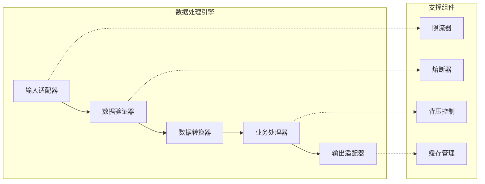

#### 2.1.1 处理引擎核心接口

```go
// ProcessingEngine 数据处理引擎接口
type ProcessingEngine interface {
    // 启动引擎
    Start(ctx context.Context) error
    
    // 停止引擎
    Stop(ctx context.Context) error
    
    // 处理数据
    Process(ctx context.Context, data *ProcessingData) (*ProcessingResult, error)
    
    // 批量处理
    ProcessBatch(ctx context.Context, batch []*ProcessingData) ([]*ProcessingResult, error)
    
    // 获取状态
    GetStatus() *EngineStatus
    
    // 更新配置
    UpdateConfig(config *EngineConfig) error
}

// ProcessingData 处理数据结构
type ProcessingData struct {
    ID          string                 `json:"id"`
    TenantID    uint64                 `json:"tenant_id"`
    UserID      uint64                 `json:"user_id"`
    Type        string                 `json:"type"`
    Payload     []byte                 `json:"payload"`
    Headers     map[string]string      `json:"headers"`
    Metadata    map[string]interface{} `json:"metadata"`
    Priority    Priority               `json:"priority"`
    Timeout     time.Duration          `json:"timeout"`
    Retry       *RetryConfig           `json:"retry"`
    CreatedAt   time.Time              `json:"created_at"`
}

// ProcessingResult 处理结果
type ProcessingResult struct {
    ID          string                 `json:"id"`
    Success     bool                   `json:"success"`
    Data        []byte                 `json:"data"`
    Error       error                  `json:"error"`
    Metadata    map[string]interface{} `json:"metadata"`
    Duration    time.Duration          `json:"duration"`
    ProcessedAt time.Time              `json:"processed_at"`
}
```

### 2.2 任务调度器架构

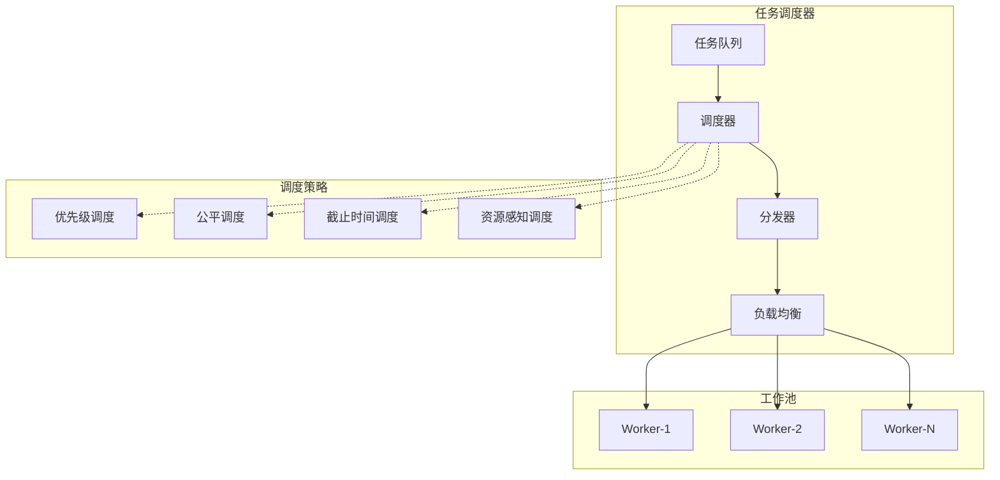

#### 2.2.1 调度器核心接口

```go
// TaskScheduler 任务调度器接口
type TaskScheduler interface {
    // 提交任务
    SubmitTask(ctx context.Context, task *Task) error
    
    // 批量提交任务
    SubmitTasks(ctx context.Context, tasks []*Task) error
    
    // 取消任务
    CancelTask(ctx context.Context, taskID string) error
    
    // 获取任务状态
    GetTaskStatus(ctx context.Context, taskID string) (*TaskStatus, error)
    
    // 暂停调度
    Pause() error
    
    // 恢复调度
    Resume() error
    
    // 获取调度统计
    GetStatistics() *SchedulerStatistics
}

// Task 任务定义
type Task struct {
    ID          string                 `json:"id"`
    TenantID    uint64                 `json:"tenant_id"`
    UserID      uint64                 `json:"user_id"`
    Type        TaskType               `json:"type"`
    Priority    Priority               `json:"priority"`
    Data        *ProcessingData        `json:"data"`
    Dependencies []string              `json:"dependencies"`
    Deadline    *time.Time             `json:"deadline"`
    Retry       *RetryConfig           `json:"retry"`
    Resources   *ResourceRequirement   `json:"resources"`
    CreatedAt   time.Time              `json:"created_at"`
    ScheduledAt *time.Time             `json:"scheduled_at"`
}

// TaskStatus 任务状态
type TaskStatus struct {
    ID          string        `json:"id"`
    State       TaskState     `json:"state"`
    Progress    float64       `json:"progress"`
    Result      *ProcessingResult `json:"result"`
    Error       error         `json:"error"`
    StartedAt   *time.Time    `json:"started_at"`
    CompletedAt *time.Time    `json:"completed_at"`
    WorkerID    string        `json:"worker_id"`
}
```

### 2.3 自适应限流架构

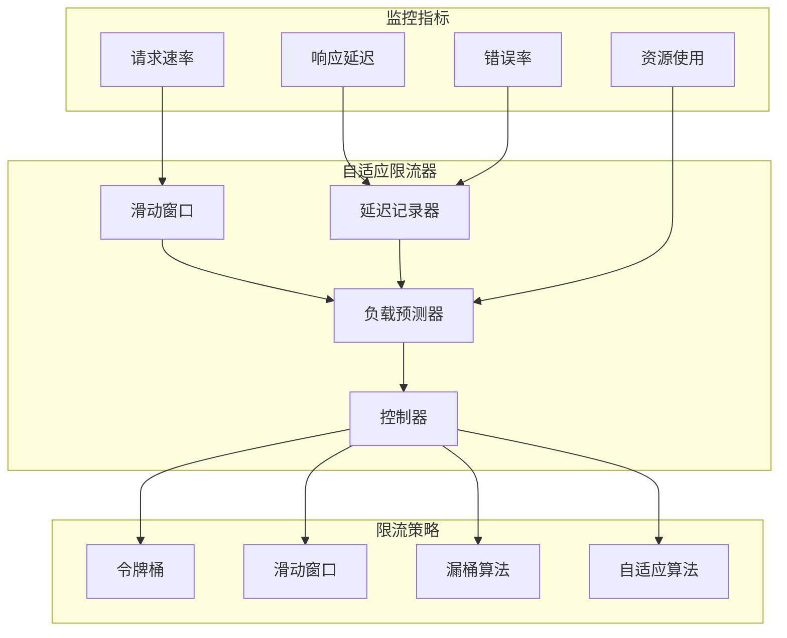

#### 2.3.1 限流器核心接口

```go
// AdaptiveRateLimiter 自适应限流器接口
type AdaptiveRateLimiter interface {
    // 请求许可
    Allow(ctx context.Context, key string) bool
    
    // 等待许可
    Wait(ctx context.Context, key string) error
    
    // 获取当前限制
    GetCurrentLimit(key string) int64
    
    // 更新配置
    UpdateConfig(config *RateLimitConfig) error
    
    // 获取统计信息
    GetStatistics() *RateLimitStatistics
    
    // 重置限制
    Reset(key string) error
}

// RateLimitConfig 限流配置
type RateLimitConfig struct {
    // 基本配置
    InitialLimit    int64         `json:"initial_limit"`
    MinLimit        int64         `json:"min_limit"`
    MaxLimit        int64         `json:"max_limit"`
    
    // 调整参数
    AdjustmentInterval time.Duration `json:"adjustment_interval"`
    LatencyThreshold   time.Duration `json:"latency_threshold"`
    ErrorThreshold     float64       `json:"error_threshold"`
    
    // 预测参数
    WindowSize         int           `json:"window_size"`
    PredictionHorizon  time.Duration `json:"prediction_horizon"`
    SmoothingFactor    float64       `json:"smoothing_factor"`
}
```

### 2.4 背压控制架构

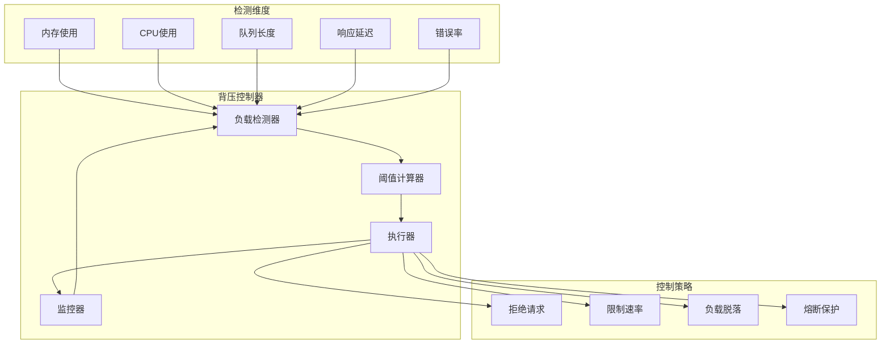

## 3. 数据流架构

### 3.1 数据处理流程

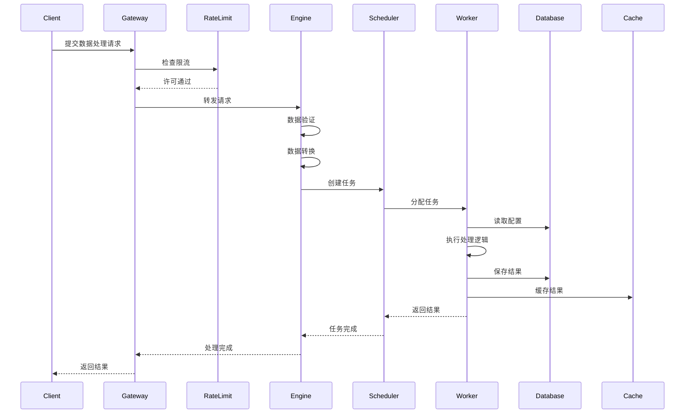

### 3.2 数据模型架构

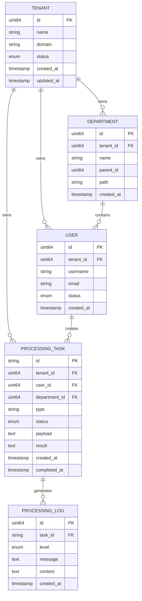

## 4. 部署架构

### 4.1 Kubernetes部署架构

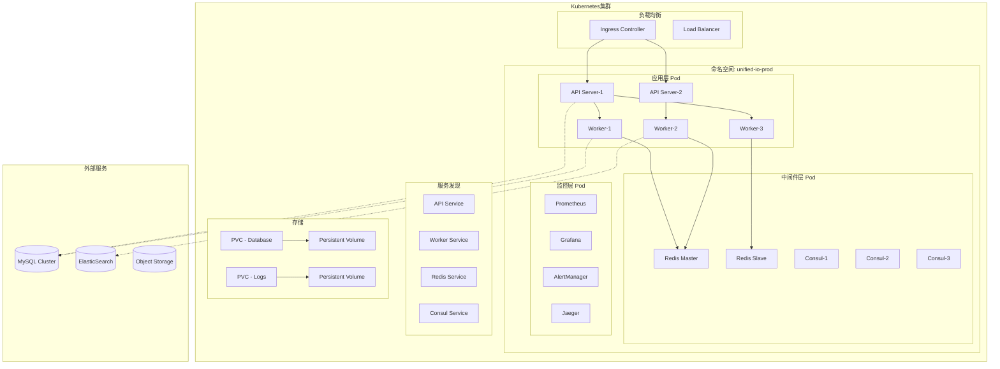

### 4.2 高可用部署方案

```yaml
# deployment.yaml
apiVersion: apps/v1
kind: Deployment
metadata:
  name: unified-io-api
  namespace: unified-io-prod
spec:
  replicas: 3
  strategy:
    type: RollingUpdate
    rollingUpdate:
      maxSurge: 1
      maxUnavailable: 0
  selector:
    matchLabels:
      app: unified-io-api
  template:
    metadata:
      labels:
        app: unified-io-api
        version: v1.0.0
    spec:
      affinity:
        podAntiAffinity:
          preferredDuringSchedulingIgnoredDuringExecution:
          - weight: 100
            podAffinityTerm:
              labelSelector:
                matchLabels:
                  app: unified-io-api
              topologyKey: kubernetes.io/hostname
      containers:
      - name: api-server
        image: unified-io:v1.0.0
        ports:
        - containerPort: 8080
          protocol: TCP
        - containerPort: 9090
          protocol: TCP
        resources:
          requests:
            memory: "256Mi"
            cpu: "250m"
          limits:
            memory: "512Mi"
            cpu: "500m"
        livenessProbe:
          httpGet:
            path: /health
            port: 8080
          initialDelaySeconds: 30
          periodSeconds: 10
        readinessProbe:
          httpGet:
            path: /ready
            port: 8080
          initialDelaySeconds: 5
          periodSeconds: 5
        env:
        - name: DB_HOST
          valueFrom:
            secretKeyRef:
              name: unified-io-secrets
              key: db-host
        - name: DB_PASSWORD
          valueFrom:
            secretKeyRef:
              name: unified-io-secrets
              key: db-password
```

## 5. 安全架构

### 5.1 多租户安全架构

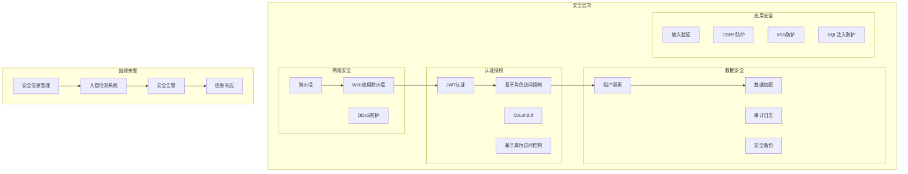

### 5.2 权限控制模型

```go
// 权限控制接口
type AccessController interface {
    // 检查权限
    CheckPermission(ctx context.Context, req *PermissionRequest) (*PermissionResponse, error)
    
    // 获取用户权限
    GetUserPermissions(ctx context.Context, userID uint64) ([]Permission, error)
    
    // 检查数据权限
    CheckDataPermission(ctx context.Context, req *DataPermissionRequest) bool
    
    // 获取数据范围
    GetDataScope(ctx context.Context, userID uint64) (*DataScope, error)
}

// 权限请求
type PermissionRequest struct {
    UserID     uint64 `json:"user_id"`
    TenantID   uint64 `json:"tenant_id"`
    Resource   string `json:"resource"`
    Action     string `json:"action"`
    Context    map[string]interface{} `json:"context"`
}

// 数据权限等级
type DataScopeLevel int

const (
    DataScopeAll         DataScopeLevel = iota // 全部数据
    DataScopeCustomDept                        // 自定义部门
    DataScopeOwnDeptAndSub                     // 本部门及子部门
    DataScopeOwnDept                           // 仅本部门
    DataScopeSelf                              // 仅本人
)
```

## 6. 监控架构

### 6.1 监控体系架构

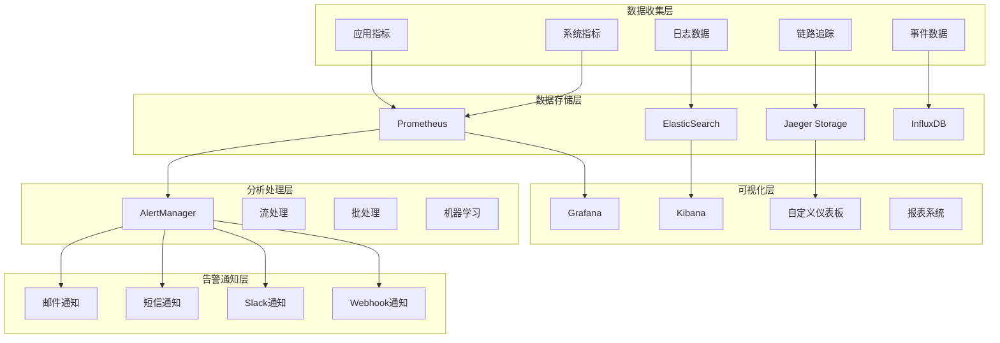

### 6.2 监控指标体系

```go
// 监控指标定义
type MetricsCollector struct {
    // 业务指标
    RequestTotal          *prometheus.CounterVec   // 请求总数
    RequestDuration       *prometheus.HistogramVec // 请求耗时
    ActiveConnections     *prometheus.GaugeVec     // 活跃连接数
    QueueSize            *prometheus.GaugeVec     // 队列大小
    
    // 系统指标
    CPUUsage             *prometheus.GaugeVec     // CPU使用率
    MemoryUsage          *prometheus.GaugeVec     // 内存使用率
    GoroutineCount       *prometheus.GaugeVec     // Goroutine数量
    GCDuration           *prometheus.HistogramVec // GC耗时
    
    // 错误指标
    ErrorTotal           *prometheus.CounterVec   // 错误总数
    PanicTotal           *prometheus.CounterVec   // Panic总数
    TimeoutTotal         *prometheus.CounterVec   // 超时总数
    
    // 业务指标
    TaskTotal            *prometheus.CounterVec   // 任务总数
    TaskDuration         *prometheus.HistogramVec // 任务耗时
    TaskQueueSize        *prometheus.GaugeVec     // 任务队列大小
}

// 指标标签
const (
    LabelTenant     = "tenant"
    LabelUser       = "user"
    LabelDepartment = "department"
    LabelService    = "service"
    LabelMethod     = "method"
    LabelStatus     = "status"
    LabelVersion    = "version"
)
```

## 7. 性能架构

### 7.1 性能优化架构

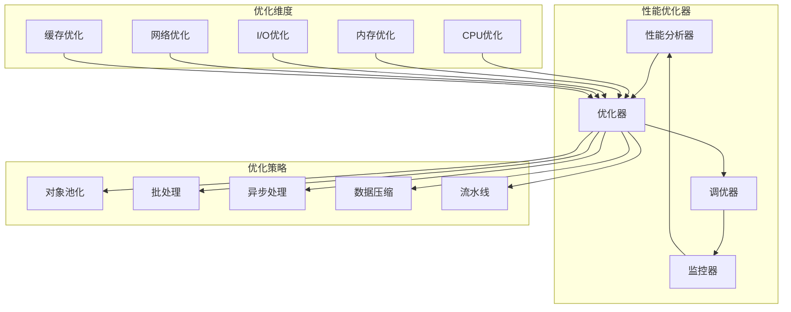

### 7.2 缓存架构设计

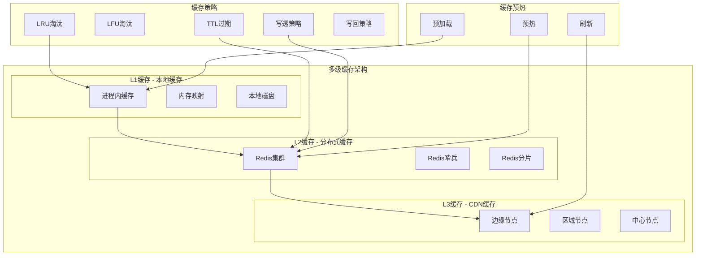

## 8. 扩展性设计

### 8.1 水平扩展架构

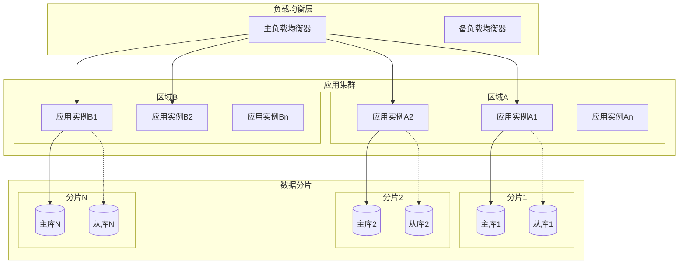

### 8.2 微服务拆分策略

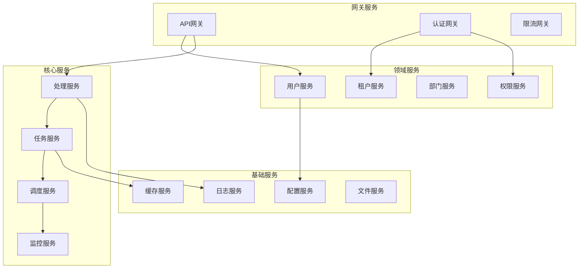

### 8.3 服务治理架构

```go
// 服务注册发现接口
type ServiceRegistry interface {
    // 注册服务
    RegisterService(ctx context.Context, service *ServiceInfo) error
    
    // 注销服务
    DeregisterService(ctx context.Context, serviceID string) error
    
    // 发现服务
    DiscoverServices(ctx context.Context, serviceName string) ([]*ServiceInfo, error)
    
    // 监听服务变化
    WatchServices(ctx context.Context, serviceName string, callback ServiceChangeCallback) error
    
    // 健康检查
    HealthCheck(ctx context.Context, serviceID string) (*HealthStatus, error)
}

// 服务信息
type ServiceInfo struct {
    ID       string            `json:"id"`
    Name     string            `json:"name"`
    Version  string            `json:"version"`
    Address  string            `json:"address"`
    Port     int               `json:"port"`
    Protocol string            `json:"protocol"`
    Tags     []string          `json:"tags"`
    Meta     map[string]string `json:"meta"`
    Health   *HealthCheck      `json:"health"`
}

// 负载均衡策略
type LoadBalanceStrategy int

const (
    RoundRobin LoadBalanceStrategy = iota
    Random
    LeastConnections
    WeightedRoundRobin
    ConsistentHash
    IPHash
)
```

## 总结

NewBee 统一数据处理平台采用现代化的微服务架构设计，具备以下关键特性：

1. **高度模块化** - 清晰的层次结构和组件边界
2. **可扩展性** - 支持水平扩展和垂直扩展
3. **高可用性** - 多级容错和自动故障转移
4. **安全性** - 多租户隔离和细粒度权限控制
5. **可观测性** - 全面的监控、日志和链路追踪
6. **性能优化** - 多级缓存和自动性能调优

该架构为企业级数据处理需求提供了solid foundation，能够支撑大规模、高并发的业务场景。